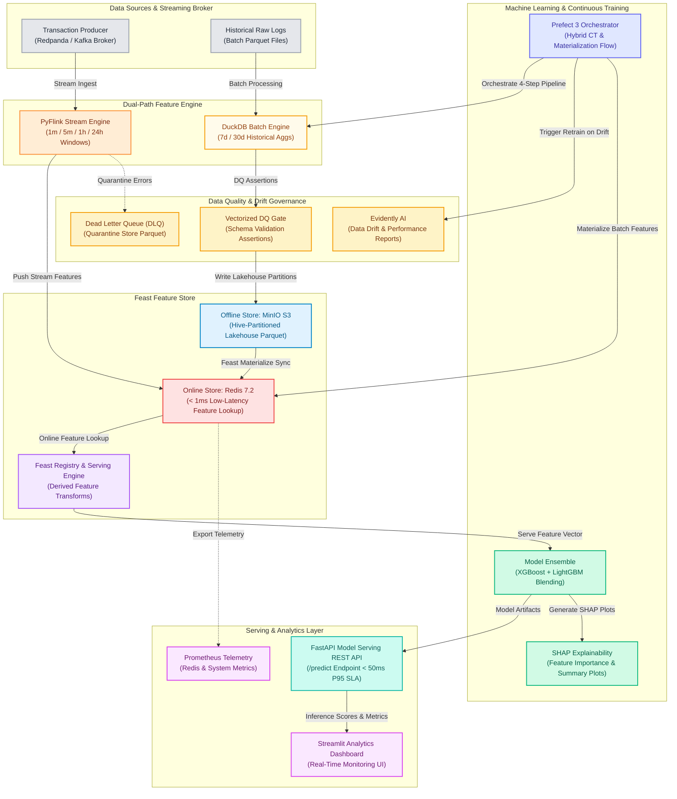
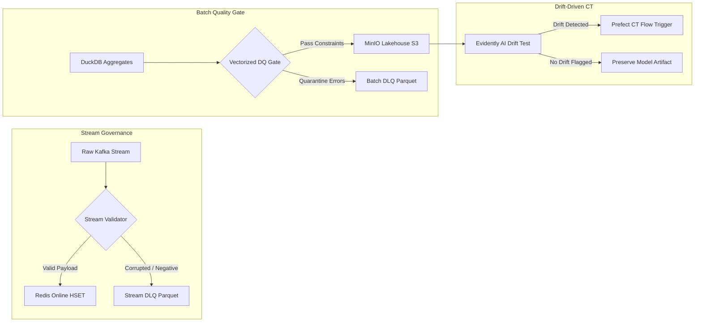

# Real-Time ML Feature Store & Fraud Detection Platform

## Project Overview

A **Real-Time Machine Learning Feature Store & Low-Latency Model Serving Platform** built for high-throughput credit card fraud detection. The platform unifies **Dual-Path Feature Processing** (PyFlink streaming window aggregations & DuckDB batch historical transforms), manages feature lifecycle via **Feast** (Redis online store for sub-1ms low-latency retrieval & MinIO S3 offline store for point-in-time joins), enforces schema data quality through a **Vectorized Data Quality Gate**, monitors feature drift via **Evidently AI**, trains an **XGBoost + LightGBM Model Ensemble** with SHAP explainability, serves online inference via **FastAPI**, orchestrates automated continuous training (CT) through **Prefect 3**, and provides operational observability using **Prometheus** and **Streamlit**.

**Business Goal:** Detect anomalous and fraudulent financial transactions in real-time under a strict **< 50ms P95 API Latency SLA** (with sub-1ms Redis feature lookup), preventing financial loss while minimizing false positives through dynamic on-demand feature transformations and automated drift-triggered continuous retraining.

---

## Architecture & Tech Stack



* **Workflow Orchestration:** 
* **Stream Processing:**  (`PyFlink`) + 
* **Batch Processing:** 
* **Feature Store Engine:** 
* **Storage Layer:**  (Online Store) +  (Offline Lakehouse)
* **Data Quality & Governance:** 
* **Machine Learning & Serving:**  + 
* **Dashboard & Observability:**  + 
* **Containerization:** 

---

## Feature Store Schema & Feature Matrix

The platform models feature definitions using Feast feature views across streaming, batch, and on-demand transformation layers:

| Feature View / Group | Source Engine / Store | Feature Name | Data Type | Transformation Logic & Description | Target Consumer |
| :--- | :--- | :--- | :---: | :--- | :--- |
| `card_stream_features` | **Direct Python / PyFlink** $\rightarrow$ Redis Store | `trans_count_1m`<br>`trans_count_5m`<br>`trans_count_1h`<br>`avg_amount_24h`<br>`stddev_amount_24h`<br>`max_amount_24h`<br>`total_amount_1h` | `Int64`<br>`Int64`<br>`Int64`<br>`Float64`<br>`Float64`<br>`Float64`<br>`Float64` | Real-time sliding window aggregations over Redpanda stream to track burst velocity and recent spending baselines | Redis Cache & Streaming Consumer |
| `card_batch_features` | **DuckDB** $\rightarrow$ MinIO Lakehouse (Feast) | `trans_count_7d`<br>`trans_count_30d`<br>`avg_amount_30d`<br>`max_amount_30d`<br>`distinct_addr_7d`<br>`days_since_last_trans` | `Int64`<br>`Int64`<br>`Float64`<br>`Float64`<br>`Int64`<br>`Float64` | Historical customer behavioral profiles computed over raw transaction lakehouse partitions | Offline Training Joins & Redis Online Materialization |
| `derived_features` | **Native Python** (`derive_transaction_features`) | `amount_ratio_30d`<br>`is_amount_gt_30d_max` | `Float64`<br>`Float64` | Dynamically derived at request time and training time:<br>• `amount / (avg_amount_30d + 1.0)`<br>• `1.0 if amount > max_amount_30d else 0.0` | FastAPI Serving REST API & Training Pipeline |

---

## Data Quality, Governance & Drift Architecture



### 1. Vectorized Data Quality Gate (`src/quality/data_assert.py`)
* Enforces non-null primary entity keys (`card_id`), positive bounds on transaction amounts (`amount > 0`), non-negative velocity counts, and finite numeric ranges via single-pass vectorized operations.
* Automatically quarantines violating records to `data/lakehouse/dlq/batch_errors.parquet` without halting pipeline execution.

### 2. Dead Letter Queue Quarantine (`data/lakehouse/dlq/`)
* Streaming records with invalid JSON formatting, negative amounts, or missing entity keys are side-outputted to `stream_errors.parquet` without blocking the streaming ingestion pipeline.

### 3. Drift-Driven Continuous Training (`src/quality/feature_monitoring.py`)
* Computes distribution divergence tests comparing production feature values against baseline reference data.
* Generates an interactive audit report (`dashboards/feature_drift_report.html`) and triggers automated retraining when drift is flagged.


---

## Inference REST API Data Contract (`/predict`)

The serving layer exposes a low-latency endpoint with predictable JSON payload contracts:

### Request Contract
```json
{
  "card_id": "11556",
  "current_amount": 750.0
}
```

### Response Contract (< 50ms P95 SLA)
```json
{
  "card_id": "11556",
  "is_fraud": 0,
  "fraud_score": 0.2000,
  "decision": "APPROVED",
  "decision_threshold": 0.5000,
  "xgb_score": 0.2000,
  "lgb_score": 0.2000,
  "latency_ms": 2.08,
  "features_used": {
    "trans_count_7d": 5.0,
    "trans_count_30d": 20.0,
    "avg_amount_30d": 150.0,
    "max_amount_30d": 500.0,
    "distinct_addr_7d": 2.0,
    "days_since_last_trans": 1.5,
    "TransactionAmt": 250.0,
    "amount_ratio_30d": 1.66,
    "is_amount_gt_30d_max": 0.0
  }
}
```

---

## Pipeline Workflow

### 1. Dual-Path Feature Ingestion Engine
* **Real-Time Stream Processing (`PyFlink` / `DirectStreamProcessor`):** Consumes live transaction streams from Redpanda/Kafka (`raw_transactions`). Calculates sliding window metrics (1m, 5m, 1h velocity counts, 24h average/stddev transaction amounts) and pushes stream features directly into the Redis online feature store (`card_stream_features`).
* **DLQ Quarantine Side Output:** Malformed JSON records, negative transaction amounts, or missing entity keys are automatically routed to a Dead Letter Queue (DLQ) side output stream and quarantined into partitioned Parquet Lakehouse (`data/lakehouse/dlq/stream_errors.parquet`).
* **Historical Batch Lakehouse (`DuckDB`):** Executes high-performance analytical queries over historical transaction logs, computing 7-day and 30-day windowed metrics (`trans_count_7d`, `trans_count_30d`, `avg_amount_30d`, `max_amount_30d`, `distinct_addr_7d`, `days_since_last_trans`). Exports partitioned Parquet files to the MinIO S3 Lakehouse (`feature-store-offline`).

### 2. Feast Feature Store & Unified Derived Features
* **Offline Point-in-Time Joins:** Feast joins historical batch features with target labels without data leakage, producing clean training datasets.
* **Online Materialization:** Synchronizes batch features from MinIO S3 Parquet into Redis online store using `store.materialize()`.
* **Unified Derived Features:** Computes dynamic real-time features at request and training time (`amount_ratio_30d`, `is_amount_gt_30d_max`) via `derive_transaction_features()`, guaranteeing zero train-serve skew.

### 3. Data Quality Assertions & Drift Monitoring
* **Vectorized Data Quality Gate:** Enforces structural integrity constraints before committing feature partitions to the Lakehouse, quarantining invalid records to DLQ Parquet.
* **Evidently AI Feature Drift Monitoring:** Compares distribution stats of current inference features against baseline reference data and generates an interactive HTML report (`dashboards/feature_drift_report.html`).


### 4. Continuous Training (CT) & Model Ensemble
* **Model Ensemble Blending:** Trains and evaluates an ensemble combining **XGBoost** and **LightGBM** classifiers. Blends prediction probabilities to maximize Precision-Recall AUC (PR-AUC) and ROC-AUC.
* **SHAP Explainability:** Calculates SHAP values to output global feature importance rankings and beeswarm distribution plots (`dashboards/shap_summary_beeswarm.png`).
* **Event-Driven Retraining:** Automatically triggers model retraining if Evidently AI flags significant dataset drift or upon scheduled cron execution.

### 5. Low-Latency REST API Serving (< 50ms P95 SLA)
* **FastAPI Server (`src/api/main.py`):** Exposes `/predict` and `/health` endpoints. On transaction request, fetches pre-calculated online features from Redis (< 1ms), evaluates on-demand derived features, runs model ensemble inference, and returns decision metrics under **50 milliseconds (P95)**.

### 6. Orchestration & Observability
* **Prefect 3 Flow (`execute.py`):** Coordinates end-to-end pipeline: Batch execution → Feast materialization → Evidently drift analysis → Hybrid CT retraining decision.
* **Dashboards:**
  * **Streamlit App (`dashboards/app.py`):** Visualizes live transactions, fraud alerts, model performance metrics, SHAP charts, and drift status.
  * **Prometheus Telemetry:** Monitors Redis memory footprint, request rate, and exporter metrics.

---

## Key Engineering Highlights

* **Dual-Path Feature Store Architecture:** Seamlessly unifies low-latency real-time streaming features (PyFlink / Direct processing) and scalable historical batch features (DuckDB + FileSource).
* **Sub-50ms End-to-End Inference SLA:** Direct Redis online feature caching (< 1ms) and warm-loaded model artifacts enable ultra-low-latency REST API prediction responses.
* **Strict DLQ Quarantine Policy:** Non-blocking streaming pipeline with dedicated Dead Letter Queue (DLQ) side outputs to isolate corrupt payloads without halting ingestion.
* **Vectorized DQ Assertions & Governance:** Integrated data validation layer preventing schema drift or invalid values from corrupting downstream models.
* **Automated Hybrid Continuous Training (CT):** Prefect 3 flow dynamically evaluates Evidently AI drift scores to automate retraining decisions, preventing model degradation.

* **Model Explainability & Transparency:** Integrates SHAP summary plots and feature contribution weights directly into prediction telemetry and analytics dashboards.

---

## Project Structure

```
ml-feature-store-platform/
│
├── feature_repository/                # Feast Feature Store Definitions
│   ├── entities.py                    # Card entity schema definition (card_id primary key)
│   ├── feature_store.yaml             # Feast provider, registry & online/offline store config
│   └── features.py                    # Batch Feature View & FileSource definitions
│
├── src/                               # System Core Source Code
│   ├── api/                           # Low-Latency Model Serving REST API
│   │   └── main.py                    # FastAPI server (< 50ms P95 SLA) fetching online features & scoring fraud
│   │
│   ├── config/                        # System Configurations
│   │   ├── __init__.py
│   │   └── settings.py                # Pydantic Settings loading environment variables & system paths
│   │
│   ├── ml/                            # Machine Learning Engine & Model Training
│   │   ├── ensemble.py                # Blended Model Ensemble wrapper (XGBoost + LightGBM)
│   │   ├── evaluate.py                # Model evaluation (PR-AUC, ROC-AUC, Confusion Matrix)
│   │   ├── explain.py                 # SHAP explainability analysis & summary plot generation
│   │   ├── prepare_dataset.py         # Offline feature joiner & train/test split dataset builder
│   │   └── train.py                   # Model ensemble training pipeline execution script
│   │
│   ├── offline/                       # Batch Feature Engine
│   │   └── batch_feature_job.py       # DuckDB analytical job: computes 7d/30d historical aggregates
│   │
│   ├── orchestration/                 # Prefect Workflow Engine
│   │   └── execute.py                 # 4-Step Prefect 3 Flow (Lakehouse, Materialize, Drift, CT)
│   │
│   ├── producer/                      # Event Simulation Stream Producer
│   │   └── producer.py                # High-frequency Redpanda/Kafka producer (normal transactions & fraud bursts)
│   │
│   ├── quality/                       # Data Quality & Drift Detection Governance
│   │   ├── data_assert.py             # Vectorized DataFrame Schema assertions & quality constraints
│   │   └── feature_monitoring.py      # Evidently AI feature drift analysis & HTML report generator
│   │
│   ├── streaming/                     # Real-Time Processing Engine
│   │   └── flink_feature_job.py       # Dual-engine job (Direct/Flink): sliding window aggregations & DLQ output
│   │
│   └── utils/                         # Infrastructure Client Utilities
│       ├── logger.py                  # Standardized ISO-8601 logging utility
│       ├── minio_client.py            # MinIO S3 object storage client & bucket helper
│       └── redis_client.py            # Redis client wrapper with connection pooling & healthchecks
│
├── dashboards/                        # UI & Monitoring Configurations
│   ├── app.py                         # Interactive Streamlit BI & Fraud Analytics Dashboard
│   └── prometheus.yml                 # Prometheus scrapers configuration (Redis exporter)
│
├── data/                              # Local Storage & Lakehouse Partitions
│   ├── batch_features.parquet         # Historical batch feature store output
│   └── lakehouse/                     # Partitioned Parquet Lakehouse & DLQ quarantine files
│
├── models/                            # Serialized Machine Learning Artifacts
│   └── ensemble_fraud_model.joblib    # Trained model ensemble binary (XGBoost + LightGBM)
│
├── tests/                             # Comprehensive Modular Test Suite (pytest)
│   ├── test_api_serving.py            # FastAPI REST API serving & inference tests
│   ├── test_config_logger.py          # Settings, ISO Logger & Ensemble verification tests
│   ├── test_ml_training.py            # Cost Matrix & Decision Threshold tests
│   ├── test_quality_gate.py           # Data Quality Gate & Quarantine tests
│   ├── test_serving_latency_benchmark.py # Sub-50ms Warm-Path Serving SLA Latency Benchmark
│   ├── test_streaming_sink.py         # DualPathRedisFeatureSink & DLQ Isolation tests
│   └── test_utils_clients.py          # MinIO & Redis Client connection & health tests
│
├── conftest.py                        # Root Pytest Configuration & Mock Fixtures
├── docker-compose.yml                 # Full stack container configuration (Redpanda, Redis, MinIO, Prometheus)
├── requirements.txt                   # Dependencies manifest
└── .env.example                       # Environment variables template
```

---

## How to Run

### 1. Clone and Configure Environment

```bash
git clone <your-repo-url>
cd ml-feature-store-platform
cp .env.example .env
# Edit .env to adjust port configurations if needed
```

### 2. Launch Infrastructure Services (Docker)

Ensure Docker Desktop is running, then boot up Redpanda, Redis, MinIO, and Prometheus:

```bash
docker compose up -d
```

Verify service status:
* **Redpanda Console:** `http://localhost:8080`
* **MinIO Console:** `http://localhost:9001` (User: `minioadmin`, Password: `minioadminpassword`)
* **Prometheus:** `http://localhost:9090`

### 3. Setup Python Virtual Environment

```bash
# Create and activate Python virtual environment
python3 -m venv .venv
source .venv/bin/activate  # On Windows: .venv\Scripts\activate

# Install required dependencies
pip install -r requirements.txt
```

### 4. Run Test Suite Verification

Run the full pytest suite to verify system logic and module integrations:

```bash
PYTHONPATH=. pytest
```

### 5. Execute Pipeline Orchestration (Prefect Flow)

Execute the 4-step Prefect orchestration pipeline locally to populate batch feature stores, perform data quality assertions, materialize online features into Redis, run drift analysis, and train the initial Model Ensemble:

```bash
PYTHONPATH=. python src/orchestration/execute.py
```

*To run as a scheduled daemon with Prefect deployment:*
```bash
PYTHONPATH=. python src/orchestration/execute.py --serve --cron "0 0 * * 0"
```

### 6. Start Real-Time Ingestion Producer & Stream Job

Launch the transaction event producer to simulate live transaction traffic (run in separate terminal sessions):

```bash
# Terminal 1: Start High-Frequency Transaction Producer
PYTHONPATH=. python src/producer/producer.py

# Terminal 2: Start Real-Time Stream Processor (Direct Python or PyFlink)
PYTHONPATH=. python src/streaming/flink_feature_job.py --engine direct
```


### 7. Launch Model Serving REST API (< 50ms P95 SLA)

Start the FastAPI low-latency inference server:

```bash
PYTHONPATH=. python src/api/main.py
```

Access API Swagger Interactive Documentation:
* Open **`http://localhost:8000/docs`** to test `/predict` and `/health` endpoints interactively.

*Sample `/predict` cURL Request:*
```bash
curl -X POST "http://localhost:8000/predict" \
     -H "Content-Type: application/json" \
     -d '{"card_id": "11556", "current_amount": 750.0}'
```

### 8. Launch Interactive Streamlit BI Dashboard

Launch the Streamlit dashboard for real-time fraud monitoring, SHAP charts, and drift reports:

```bash
streamlit run dashboards/app.py
```
Open **`http://localhost:8501`** in your browser.
